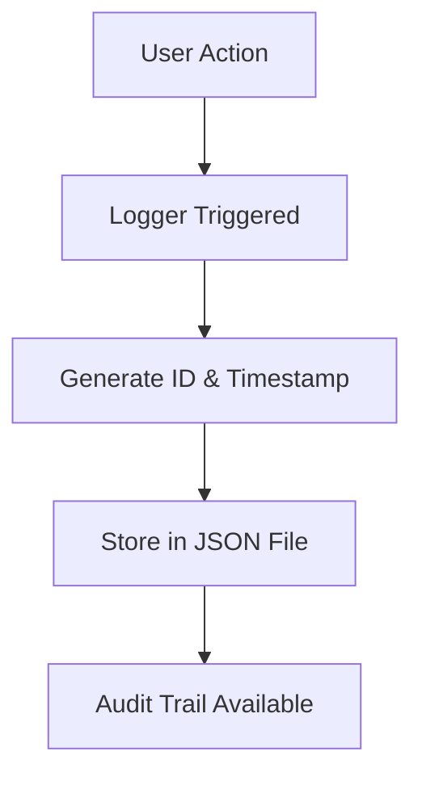

# 🔐 Advanced Event Logging & Audit Trail System

<p align="center">
  <b>Track • Monitor • Secure • Analyze</b><br>
  A production-ready logging system built in Python 🚀
</p>

---

## 📌 Project Overview

The **Advanced Event Logging & Audit Trail System** is designed to record and monitor every action performed within a system.

This module is part of the **AI Interview and Assessment System**, ensuring:

* 🔍 Full transparency
* 🛠️ Easy debugging
* 🔐 Improved security

---

## ✨ Features

* 📌 Full audit trail of all user actions
* ⏱️ Timestamp-based logging
* 🆔 Unique log ID for each event
* 👤 Tracks user (ID & role)
* 🧩 Module-wise tracking (Auth, Assessment, etc.)
* 📄 JSON structured logs
* ⚡ Lightweight and easy to integrate

---

## 🧱 Project Structure

```
audit_project/
│── audit_logger.py   # Core logging module
│── main.py           # Simulation script
│── audit_logs.json   # Generated logs
```

---

## 🛠️ Tech Stack

| Technology | Purpose            |
| ---------- | ------------------ |
| Python 🐍  | Core development   |
| JSON 📄    | Log storage format |

---

## ▶️ Getting Started

### 🔹 Clone the Repository

```
git clone https://github.com/your-username/audit-logging-system.git
```

### 🔹 Navigate to Project

```
cd audit-logging-system
```

### 🔹 Run the Project

```
python main.py
```

---

## 📊 Sample Log Output

```json
{
  "log_id": "a1b2c3",
  "timestamp": "2026-04-14 10:00:00",
  "user_id": "CAND001",
  "role": "Candidate",
  "action": "Login",
  "module": "Auth",
  "status": "Success",
  "details": "User logged in successfully"
}
```

---

## 🧠 How It Works



---

## 🚀 Future Enhancements

* 🗄️ Database Integration (MySQL / MongoDB)
* 📊 Admin Dashboard for log visualization
* ⚠️ Suspicious activity detection
* 🌐 FastAPI integration
* 📈 Real-time monitoring system

---

## 🏆 Key Highlights

✔ Industry-level logging structure
✔ Easy integration into backend systems
✔ Helps in debugging and tracking
✔ Scalable for production systems

---

## 👨‍💻 Author

**Chetan Deve**


<p align="center">
  Made with ❤️ by Chetan
</p>
